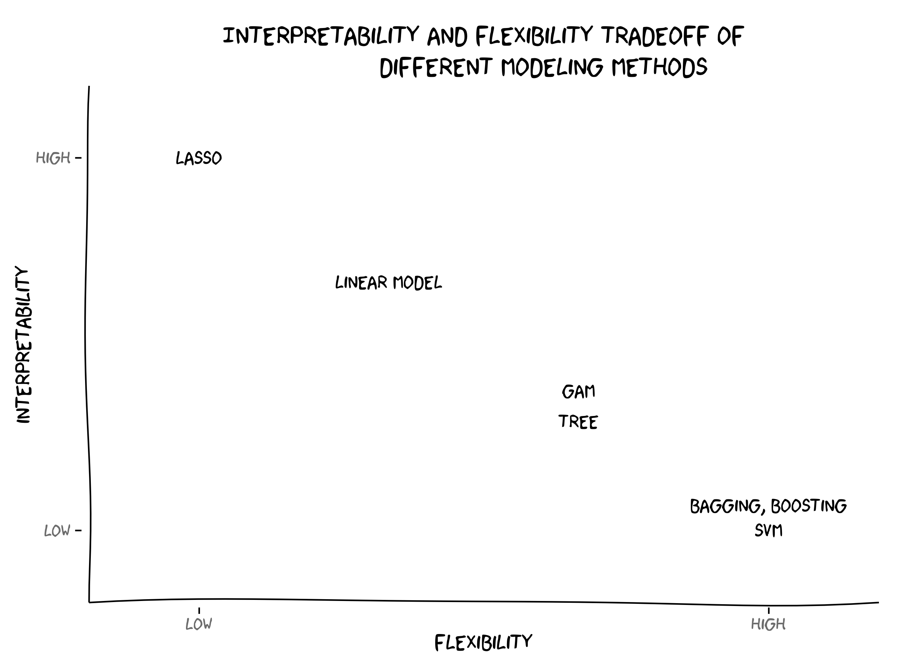

```{r, child="setup.Rmd", echo=FALSE}
```

.center[
# What is statistical learning?
]

- **Building a (statistical) model to represent relationships between different quantities**

--

Quantities are defined here very broadly to be data or measurements

---

.center[
# What is statistical learning?
]

- Building a (statistical) model to represent relationships between different quantities
- **Using data to create rules**

---

.center[
# What is statistical learning?
]

.center[

]

---

# What is statistical Learning?

Some machine learning methods have a statistical underpinning

This allows us to quantify the uncertainty

Examples of "non-statistical machine learning methods" are

- Genetic algorithms
- K-nearest neighbors

There is not a hard and fast distinction. Machine learning is about getting answers. Statistics is a great way to find answers.

---

# Why use statistical Learning?

The main goals are

- Understanding/Inference
- Prediction

---

# General setup

For response $Y$ and $p$ different predictors $X_1, X_2, ..., X_p$

Then the relationship between them can be written as

$$Y = f(X) + \epsilon$$

with $\epsilon$ being a random *error term*, independent from $X$  and has mean 0.

--

This formulation is VERY general.  
There is no assumption that $f$ provides any information.

--

Our goal is to find $f$ 

--

Y: response/dependent variable  
X: predictors, independent variables, features/variables

---

# Why estimate f?

If $f$ is different than the null-model or monkey model.

- Prediction
- Inference

---

# Prediction

Main thesis:

> If we can find f then we can predict the value of Y for different values of X

This holds a major assumption that the scenario in which we estimate $f$ stays the same.

Models trained on data from a recession may not apply to data in a depression

Models trained on low-income houses might not work on high-income houses

---

# Covid-19 data

.center[

]

https://twitter.com/topepos/status/1333967942686543873

---

# Prediction

$$\hat{Y} = \hat{f}(X)$$

--

.pull-left[
```{r, echo=FALSE, message=FALSE}
library(tidyverse)

set.seed(12345)

dat <- tibble(x = 1:50) %>%
  mutate(y_real = sin(x/pi/3),
         y = y_real + rnorm(n(), sd = 0.2))
```


```{r, echo=FALSE}
dat %>%
  ggplot(aes(x, y)) +
  geom_point() +
  theme_minimal()
```
]

--

.pull-right[
```{r, echo=FALSE}
dat %>%
  ggplot(aes(x, y)) +
  geom_point() +
  theme_minimal() +
  geom_line(aes(y = 0), color = "blue") +
  geom_segment(aes(x = x, xend = x, y = y, yend = 0), alpha = 0.25)
```
]

---

# Prediction

$$\hat{Y} = \hat{f}(X)$$

.pull-left[
```{r, echo=FALSE}
dat %>%
  ggplot(aes(x, y)) +
  geom_point() +
  theme_minimal()
```
]

.pull-right[
```{r, echo=FALSE}
dat %>%
  ggplot(aes(x, y)) +
  geom_point() +
  theme_minimal() +
  geom_step(aes(y = y, x = x -0.5), color = "blue")
```
]

---

# Prediction

$$\hat{Y} = \hat{f}(X)$$

.pull-left[
```{r, echo=FALSE}
dat %>%
  ggplot(aes(x, y)) +
  geom_point() +
  theme_minimal()
```
]

.pull-right[
```{r, echo=FALSE}
dat %>%
  ggplot(aes(x, y)) +
  geom_point() +
  theme_minimal() +
  geom_line(aes(y = y_real), color = "blue") +
  geom_segment(aes(x = x, xend = x, y = y, yend = y_real), alpha = 0.25)
```
]

---

# Tradeoff between reducible error and irreducible error

The error is how much $f$ is different from $\hat{f}$

We split this into **reducible** and **irreducible**

We will generally not be able to completely predict anything from a limited number of features  
Any error left when a perfect statistical model is trained is the irreducible error  

Sub-optimal estimates of $\hat{f}$ introduce error which could have been reduced.

(this hinges on a more philosophical basis. Is the world fully deterministic?)

---

# Tradeoff between reducible error and irreducible error

If we could, we technically have a mathematical formula.  

> amount of sales tax on an item

is generally not statistical
you might need a complicated model, but you should be able to eliminate all the error

---

# Tradeoff between reducible error and irreducible error

Examples with error:

bolt factory. Estimate the weight of the bolt.

Machines are calibrated, but things like, temperature, air quality, material quality, particles will still play (a small) factor.

---

# Inference

Understanding how Y is related to X

We want to understand the exact form

"What effect will changing price affect the rating of a product?"

This is inference. We are primarily interested in the effect, not the outcome

---

As we will see later, there is a trade-off between models that work well for prediction and easily explainable models

.center[

]

---

# Inference vs prediction

hard to explain models can be good predictors but bad for inference  


Certain fields will hold different weight on explainability/interpretability

---

# Supervised vs Unsupervised Learning

Most of what we will are working on is going to be supervised.  
The learning we are doing is based on a specific parameter Y we are working around

--

unsupervised learning on the other hand doesn't have an explicit goal or answer sheet

--

- pattern matching
- clustering

--

> "here is all our customer data, do they form groups?"

---

# Model accuracy

the book covers **mean squared error**

There are many ways to access how well a model performs.

many of these will be related to how far away the prediction is from the observation

---

# Linear models

We have seen this before so we are just freshening up

Start with simple

$$Y = \beta_0 + \beta_1 X + \epsilon$$

Where $X$ is a single predictor variable

--

Notice this is 

$$ f(X) = \beta_0 + \beta_1 X $$

We need to find the values for the betas that makes it the line as close to the data as possible

```{r, echo=FALSE}
linear_data <- tibble(x = seq(100, 300)) %>%
  mutate(y = 5 + 0.05 * x + rnorm(n())) 
```

---

.pull-left[
Consider the data on the right

It appears to have a possible linear trend
]

.pull-right[
```{r echo=FALSE, fig.asp = 1}
linear_data %>%
  ggplot(aes(x, y)) +
  geom_point() +
  theme_minimal()
```
]

---

.pull-left[
Consider the data on the right

It appears to have a possible linear trend

If we draw a simple horizontal line for `y = 16`

This would be $\beta_0 = 16, \beta_1 = 0$

If we take the square of all the vertical lines and sum them we get

```{r, echo=FALSE}
linear_data %>%
  mutate(resid = y - 16,
         rs = resid ^ 2) %>%
  summarise(rss = sum(rs))
```
]

.pull-right[
```{r echo=FALSE, fig.asp = 1}
linear_data %>%
  ggplot(aes(x, y)) +
  geom_point() +
  theme_minimal() +
  geom_abline(intercept = 16, slope = 0, color = "blue") +
  geom_segment(aes(x = x, xend = x, y = y, yend = 16), alpha = 0.25)
```
]

---

.pull-left[
Consider the data on the right

It appears to have a possible linear trend

If we minimize the RSS then we would get $\beta_0 = 5.31537, \beta_1 = 0.04897$

With a resulting RSS of

```{r, echo=FALSE}
lm_fit <- broom::tidy(lm(y ~ x, linear_data))$estimate

linear_data %>%
  mutate(resid = y - (lm_fit[1] + lm_fit[2] * x),
         rs = resid ^ 2) %>%
  summarise(rss = sum(rs))
```
]

.pull-right[
```{r echo=FALSE, fig.asp = 1}
linear_data %>%
  ggplot(aes(x, y)) +
  geom_point() +
  theme_minimal() +
  geom_abline(intercept = 5.31537, slope = 0.04897, color = "blue") +
  geom_segment(aes(x = x, xend = x, y = y, yend = 5.31537 + x * 0.04897), alpha = 0.25)
```
]

---

.pull-left[
Consider the data on the right

Overlaying the true relationship in orange

since we are only receiving a sample of the underlying distribution, we are not able to completely determine the right slope and intercept
]

.pull-right[
```{r echo=FALSE, fig.asp = 1}
linear_data %>%
  ggplot(aes(x, y)) +
  geom_point() +
  theme_minimal() +
  geom_abline(intercept = 5.31537, slope = 0.04897, color = "blue") +
  geom_abline(intercept = 5, slope = 0.05, color = "orange") +
  geom_segment(aes(x = x, xend = x, y = y, yend = 5.31537 + x * 0.04897), alpha = 0.25)
```
]

---

# Least Square Criterion

We are minimizing the residual sum of squares (RSS)

$$
\begin{align}
\hat{\beta}_1 &= \dfrac{\sum^n_{i=1}(x_i - \bar{x})(y_i - \bar{y})}{\sum^n_{i=1}(x_i - \bar{x})^2}  \\
\hat{\beta}_0 &= \bar{y} - \hat{\beta}_1 \bar{x}
\end{align}
$$

Where $\bar{x}$ and $\bar{y}$ are sample means of $x$ and $y$

---

# Hypothesis tests

Since this model is built on certain assumptions, we can calculate standard error estimates for each parameter estimate.

These standard errors can be used to determine if the estimates are significantly different from 0

An inverse relationship between the size of effect and number of observations

---

# Assessing model accuracy

How much does the model fit the data?

We want to know **how well** the model is performing

Again a measure of how far away the predictions are away from the actual model

---

# Assessing model accuracy

Remember how *residuals squared sum* (RSS) depended on the number of observations?

--

$$ RSE = \sqrt{\dfrac{1}{n-2} RSS} = \sqrt{\dfrac{1}{n-2} \sum\limits^n_{i=1}(y_i - \hat{y}_i)^2}$$

*residual standard error* takes care of this by normalization

Interpretation:

> RSE is the average amount that the response will deviate from the true regression line

RSE measures the lack of fit. Smaller values are better

---

# Assessing model accuracy

$$ R^2 = 1 - \dfrac{RSS}{TSS}$$

where $TSS = \sum(y_i - \bar{y})^2$ is the total sum of squares

Interpretation:

> $R^2$ is the proportion of variance explained

takes values between 0 and 1, higher being better

---

# Multiple linear regression

This is a simple extension, 

$$Y = \beta_0 + \beta_1 X_1 + \beta_2 X_2 + \cdots + \beta_p X_p  + \epsilon$$

All the previous questions apply here with slightly different answers

---

# Model selection

When $p=1$ we have the question

> Is there an association between Y and X

but when $p>1$ then question becomes

> Is at least one of the predictors $X_1, X_2, ..., X_p$ useful in predicting the response

and 

> Which of the X's have an association with Y

---

# F statistics

> Is at least one of the predictors $X_1, X_2, ..., X_p$ useful in predicting the response

$$  F = \dfrac{(TSS-RSS)/p}{RSS/(n-p-1)}  $$

If F-statistic is close to 1 then we suspect there is no relationship between the response and predictors

---

# Model selection

- Forward selection
- Backward selection
- Mixed selection

---

# Qualitative predictors

We will come back to this later

---

# Model assumptions 

The linear model works well in a lot of cases.

But there are assumptions

1. Linear relationship: There exists a linear relationship between the independent variable, x, and the dependent variable, y.
2. Independence: The residuals are independent. In particular, there is no correlation between consecutive residuals in time series data.
3. Homoscedasticity: The residuals have constant variance at every level of x.
4. Normality: The residuals of the model are normally distributed.

---

# Model assumptions 

If the assumptions are not met then the model will not be sound

--

If the error terms are correlated, we may have an unwarranted sense of confidence in our model

---

# Outliers

You should be careful to throw out data that does not fit well into your model

- Don't remove points because they result in a bad fit
- Remove data if they are wrongly collected
- Consider using a model that isn't affected much by outliers

domain, linear models perform badly if some of the observations are FAR away from the other points

---

# User-facing problems in modeling in R

- Data must be a matrix (except when it needs to be a data.frame)
- Must use formula or x/y (or both)
- Inconsistent naming of arguments (ntree in randomForest, num.trees in ranger)
- na.omit explicitly or silently
- May or may not accept factors

---

# Syntax for Computing Predicted Class Probabilities

|Function     |Package      |Code                                       |
|:------------|:------------|:------------------------------------------|
|`lda`        |`MASS`       |`predict(obj)`                             |
|`glm`        |`stats`      |`predict(obj, type = "response")`          |
|`gbm`        |`gbm`        |`predict(obj, type = "response", n.trees)` |
|`mda`        |`mda`        |`predict(obj, type = "posterior")`         |
|`rpart`      |`rpart`      |`predict(obj, type = "prob")`              |
|`Weka`       |`RWeka`      |`predict(obj, type = "probability")`       |
|`logitboost` |`LogitBoost` |`predict(obj, type = "raw", nIter)`        |

blatantly stolen from Max Kuhn

---

.center[

]

---

The goals of `parsnip` is...  

- Decouple the *model classification* from the *computational engine*
- Separate the definition of a model from its evaluation
- Harmonize argument names
- Make consistent predictions (always tibbles with na.omit=FALSE)

---

```{r, warning=FALSE}
model_lm <- lm(mpg ~ disp + drat + qsec, data = mtcars)
```

---

```{r}
library(parsnip)
model_lm <- linear_reg() %>%
  set_mode("regression") %>%
  set_engine("lm")
model_lm
```

--

```{r, warning=FALSE}
fit_lm <- model_lm %>%
  fit(mpg ~ disp + drat + qsec, data = mtcars)
fit_lm
```


---

# Tidy prediction

```{r}
predict(fit_lm, mtcars)
```
