```{r, child="setup.Rmd", echo=FALSE}
```

# Clustering

This is a case of .orange[unsupervised learning]

We are working with .blue[unlabeled data]

---

# Unsupervised Learning

- Clustering
- Anomaly Detection
- Dimensionality Reduction
- Association Rules

We are trying to find patterns and/or structure in the data

---

# Unsupervised Learning

The main characteristic for unsupervised learning is that we have .blue[unlabeled data]

So far when working with supervised learning we have had a response variable $Y$ and some predictors variables $X$

This time we only have $X$

Our goal is to see if there is anything we can get out of this information

---

# Clustering

Trying to divide/partition the $n$ observations into several sub-groups/clusters

How do we do this?

---

# Centroid-based Clustering

.center[
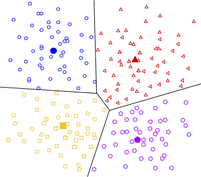
]

---

# Density-based Clustering

.center[
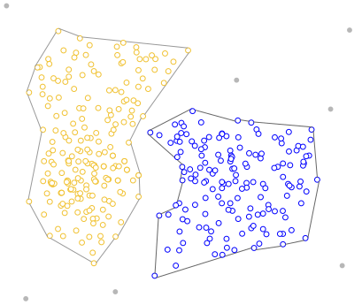
]

---

# Distribution-based Clustering

.center[

]

---

# Hierarchical Clustering

.center[
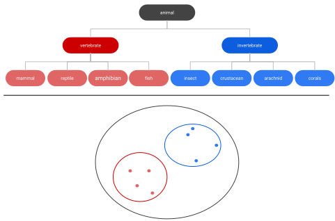
]

---

## Uses of Clustering

- Semi-Supervised Learning
- EDA
- Pre-processing
- Clusters as Analysis

---

# Semi-Supervised Learning

If we have class labels on *some* of the objects, we can apply unsupervised clustering, then let the clusters be defined by their class enrichment of labeled objects.

A word of caution for this approach: Just because a clustering structure doesn't align with known labels doesn't mean it is "wrong". It could be capturing a different (true) aspect of the data than the one we have labels for.

---

# EDA

Sometimes clustering is applied as a first exploratory step, to get a sense of the structure of the data. This is somewhat nebulous and usually involves eyeballing a visualization.

---

# Pre-processing

Clustering can be used to discover relationships in data that are undesirable, so that we can *residualize* or *decorrelate* the objects before applying an analysis.

A great example of this is in genetics, where we have measurements of gene expression for several subjects. Typically, gene expression is most strongly correlated by race. If we cluster the subjects on gene expression, we can then identify unwanted dependence to remove from the data.

---

# Clusters as analysis

Sometimes, the assignment of cluster membership *is* the end goal of the study. For example:

In the Enron corruption case in 2001, researchers created a network based on who emailed who within the company. They then looked at which clusters contained known conspirators and investigated the other individuals in those groups. 

In the early days of breast cancer genetic studies, researchers clustered known patients on genetic expression, which led to the discovery of different tumor types (e.g. Basal, Her-2, Luminal). These have later been clinically validated and better defined.

---

# How are clusters found?

One way is to define a geometry that is used to determine whether 2 points are close to each other

Having the "distances" between points allows us to see if there are any points with a lot of "friends"

---

# How are clusters found?

We will focus .blue[K-means clustering] and .pink[Hierarchical clustering]

Which are .blue[Centroid-based Clustering] and .pink[Hierarchical Clustering] respectively

---

# Survey of many more clustering methods

[A Comprehensive Survey of Clustering Algorithms](https://link.springer.com/article/10.1007/s40745-015-0040-1) 

by Dongkuan Xu & Yingjie Tian 

---

# K-Means Clustering

A simple and elegant approach

Intuitively easy to understand

Does partitioning into K non-overlapping clusters

---

# K-Means Clustering

We let $C_1, ..., C_K$ denote sets of indices of the observations in each cluster.

For K-Means we have that the union of $C_1, ..., C_K$ is equal to $1, ..., n$ and that there is no overlap between the sets

---

# K-Means Clustering

We are trying to maximize/optimize something

K-means states that we want to minimize the *within-cluster variation*

$$\underset{C_1, ..., C_K}{\text{minimize}}\left\{ \sum_{k=1}^K W(C_k) \right\}$$

This is a reasonable starting point. But we need to define $W$

---

# K-Means Clustering

The most common way is using *squared Euclidean distance*

$$W(C_k) = \dfrac{1}{|C_k|} \sum_{i, i' \in C_k}\sum_{j=1}^p(x_{ij} - x_{i'j})^2$$

here $|C_k|$ denote the number of observations in the $k$th cluster

---

# K-Means Clustering

The variation is defined as the sum of all the pairwise squared euclidean distances between the observations within a cluster

There is no closed-form solution to this since the function isn't smooth

We have to find a way to walk through the different partitions to find a good one. HOWEVER!!

Since we are working with partitions the number goes up VERY fast as $K^n$

---

# K-Means Clustering

1. Randomly assign a number, from 1 to $K$, to each of the observations. These serve as initial cluster assignments for the observations.
2. iterate until the cluster assignments stop changing
    a. For each of the $K$ clusters, compute the cluster *centroid*. The $k$th cluster centroid is the vector of the $p$ feature means for the observations in the $k$th cluster.
    b. Assign each observation to the cluster whose centroid is .blue[closest]
    
Here .blue[closest] is defined using Euclidean distance

---

.center[

]

.footnote[Art by Allison Horst]

---

.center[

]

.footnote[Art by Allison Horst]

---

.center[

]

.footnote[Art by Allison Horst]

---

.center[

]

.footnote[Art by Allison Horst]

---

.center[

]

.footnote[Art by Allison Horst]

---

.center[

]

.footnote[Art by Allison Horst]

---

.center[
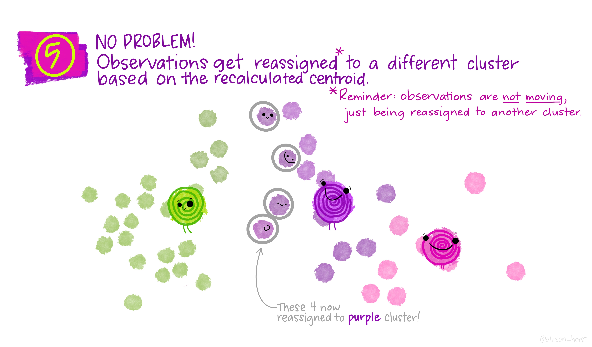
]

.footnote[Art by Allison Horst]

---

.center[

]

.footnote[Art by Allison Horst]

---

.center[

]

.footnote[Art by Allison Horst]

---

.center[
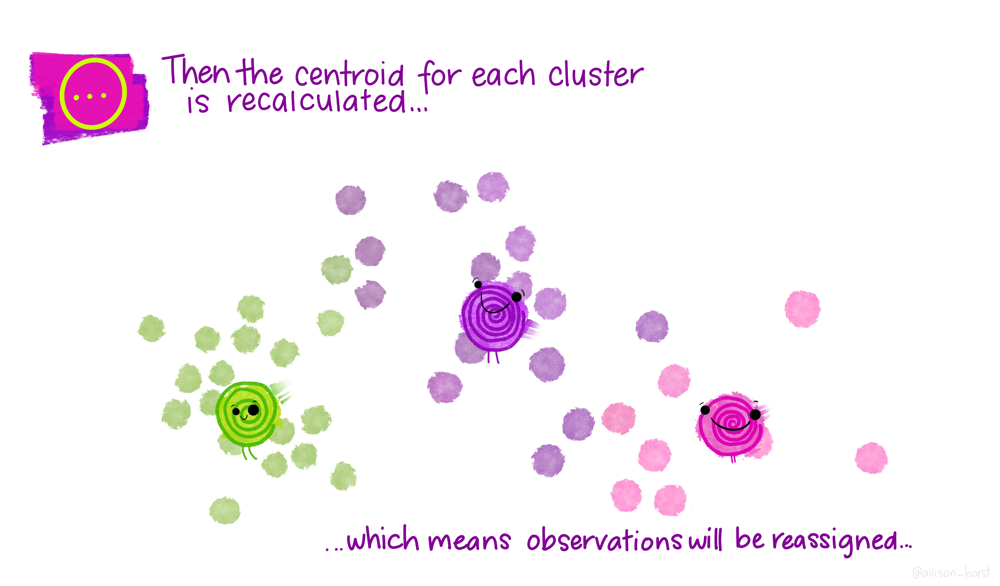
]

.footnote[Art by Allison Horst]

---

.center[
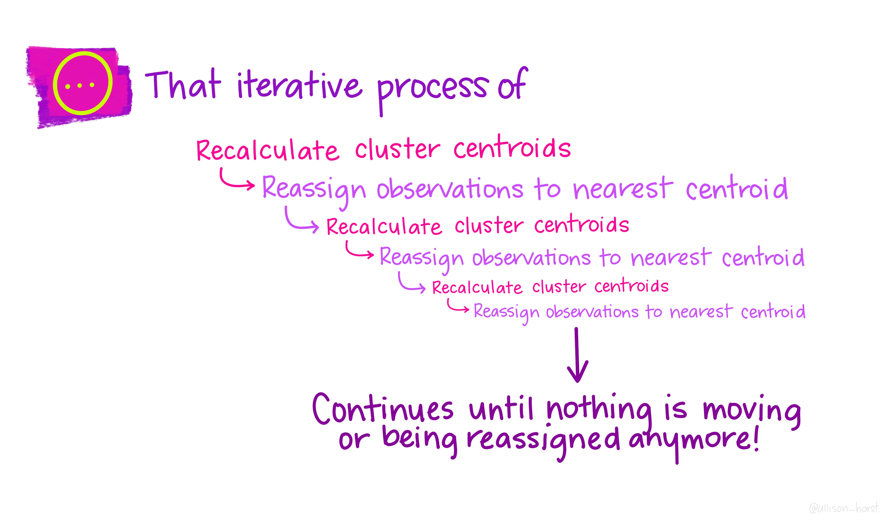
]

.footnote[Art by Allison Horst]

---

.center[

]

.footnote[Art by Allison Horst]

---

# Scaling


Since we are using a Euclidean measure you need to scale the variables to make sure the clusters are being influenced evenly

---

# With scaling

```{r, echo=FALSE, message=FALSE}
library(palmerpenguins)
library(tidyverse)

pen_mat <- penguins %>%
  select(bill_length_mm, flipper_length_mm) %>%
  drop_na() %>%
  as.matrix() %>%
  scale()

map_dfr(
  1,
  ~ broom::augment(kmeans(pen_mat, centers = 3), pen_mat), 
  .id = "run") %>%
  ggplot(aes(bill_length_mm, flipper_length_mm, color = .cluster)) +
  geom_point() +
  scale_color_manual(values = c(blue, orange, pink)) +
  theme_void() +
  guides(color = "none") +
  coord_fixed()
```

---

# Without scaling

```{r, echo=FALSE}
pen_mat <- penguins %>%
  select(bill_length_mm, flipper_length_mm) %>%
  drop_na() %>%
  as.matrix()

map_dfr(
  1,
  ~ broom::augment(kmeans(pen_mat, centers = 3), pen_mat), 
  .id = "run") %>%
  ggplot(aes(bill_length_mm, flipper_length_mm, color = .cluster)) +
  geom_point() +
  scale_color_manual(values = c(blue, orange, pink)) +
  theme_void() +
  guides(color = "none") +
  coord_fixed()
```

---

# Initialization Matters

There is no natural ordering in the clusters, keep that in mind when doing the analysis

---

# No natural ordering of Clusters

```{r, echo=FALSE}
library(palmerpenguins)
library(tidyverse)

pen_mat <- penguins %>%
  select(bill_length_mm, flipper_length_mm) %>%
  drop_na() %>%
  as.matrix() %>%
  scale()

map_dfr(
  1:9,
  ~ broom::augment(kmeans(pen_mat, centers = 3), pen_mat), 
  .id = "run") %>%
  ggplot(aes(bill_length_mm, flipper_length_mm, color = .cluster)) +
  geom_point() +
  scale_color_manual(values = c(blue, orange, pink)) +
  theme_void() +
  guides(color = "none") +
  facet_wrap(~run)
```

---

# Advantages of K-Means

- Relatively simple to implement
- Scales to large data sets
- Guarantees convergence
- Can warm-start the positions of centroids
- Easily adapts to new examples

---

# Downsides to K-means

- you have to specify the number of clusters

We can do many different values of $K$ and draw the .blue[elbow chart]

---

```{r, echo=FALSE}
pen_mat <- penguins %>%
  select(bill_length_mm, flipper_length_mm) %>%
  drop_na() %>%
  as.matrix() %>%
  scale()

map_dfr(
  1:9,
  ~ broom::augment(kmeans(pen_mat, centers = .x), pen_mat), 
  .id = "run") %>%
  mutate(run = paste0("K = ", run)) %>%
  ggplot(aes(bill_length_mm, flipper_length_mm, color = .cluster)) +
  geom_point() +
  theme_void() +
  guides(color = "none") +
  facet_wrap(~run) +
  scale_color_brewer(palette = "Set3")
```

---

```{r, echo=FALSE}
pen_mat <- matrix(rnorm(1000), ncol = 2)

map_dfr(
  1:9,
  ~ broom::augment(kmeans(pen_mat, centers = .x), pen_mat), 
  .id = "run") %>%
  mutate(run = paste0("K = ", run)) %>%
  ggplot(aes(X1, X2, color = .cluster)) +
  geom_point() +
  theme_void() +
  guides(color = "none") +
  facet_wrap(~run) +
  scale_color_brewer(palette = "Set3")
```

---

# Elbow chart for separated data

```{r, echo=FALSE}
pen_mat <- penguins %>%
  select(bill_length_mm, flipper_length_mm) %>%
  drop_na() %>%
  as.matrix() %>%
  scale()

map_dfr(
  1:9,
  ~ broom::glance(kmeans(pen_mat, centers = .x), pen_mat), 
  .id = "clusters") %>%
  mutate(clusters = as.numeric(clusters)) %>%
  ggplot(aes(clusters, tot.withinss)) +
  geom_point() +
  geom_line() +
  theme_minimal()
```

---

# Elbow chart for normal data

```{r, echo=FALSE}
pen_mat <- matrix(rnorm(1000), ncol = 2)

map_dfr(
  1:9,
  ~ broom::glance(kmeans(pen_mat, centers = .x), pen_mat), 
  .id = "clusters") %>%
  mutate(clusters = as.numeric(clusters)) %>%
  ggplot(aes(clusters, tot.withinss)) +
  geom_point() +
  geom_line() +
  theme_minimal()
```

---

# Downsides to K-means

- Can only use numerical X
- k-means assumes that we deal with spherical clusters and that each cluster has roughly equal numbers of observations
- Being dependent on initial values.
- Clustering data of varying sizes and densities.
- Clustering outliers.
- Scaling with the number of dimensions.
- Kmeans may still cluster the data even if it can’t be clustered such as data that comes from uniform distributions.

---

# Hierarchical clustering

One of the main assumptions when using K-means is that we need to specify the number of clusters we want to find.

Hierarchical clustering is an alternative approach where we won't have to do this

We also get a tree-based representation of the data

---

# Hierarchical clustering

HC works as a bottom-up/agglomerative method

We start by having each observation being its own class, then we iteratively merge nearby classes

A good thing about HC is that we only have to calculate once, then we can take some time to decide on the cutting location

---

# Hierarchical clustering

1. Begin with $n$ observations and a measure (such as Euclidean distance) of all the pairwise dissimilarities. Treat each observation as its own cluster.
2. For $i = n, n-1, ..., 2$
    a. Examine all pairwise inter-cluster dissimilarities among the $i$ clusters and identify the pair of clusters that are least dissimilar. Fuse these two clusters. The dissimilarity between these two clusters indicates the height in the dendrogram at which the fusion should be placed.
    b. Compute the new pairwise inter-cluster dissimilarities among the $i-1$ remaining clusters
    
---

.center[
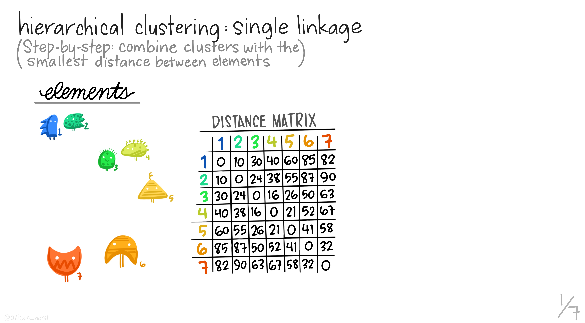
]

.footnote[Art by Allison Horst]

---

.center[
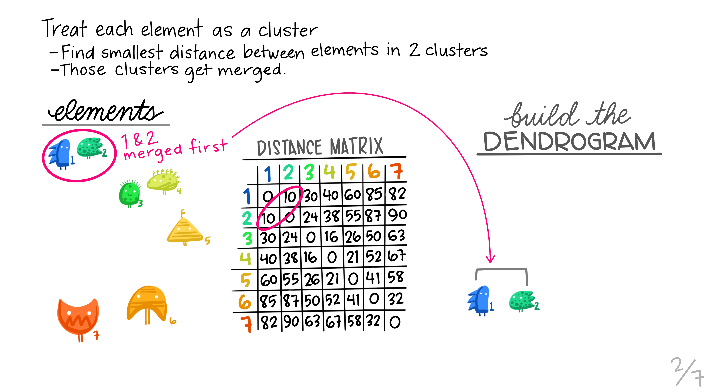
]

.footnote[Art by Allison Horst]

---

.center[
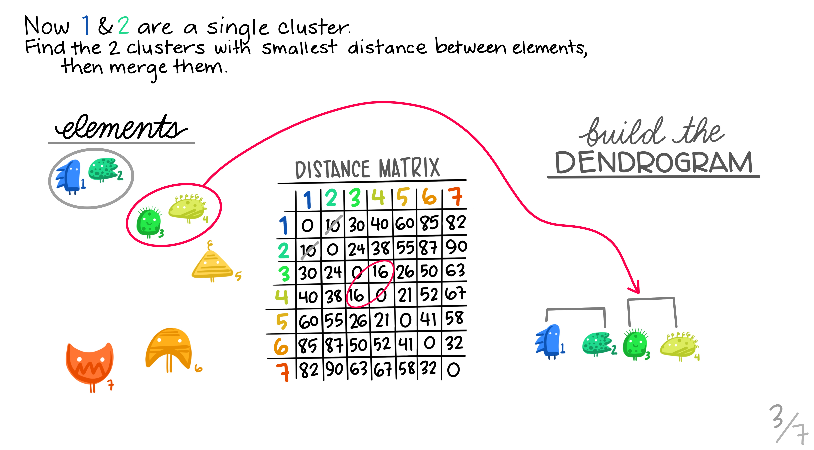
]

.footnote[Art by Allison Horst]

---

.center[
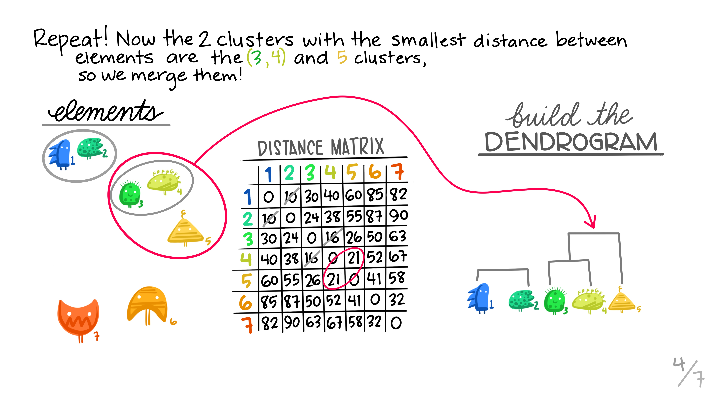
]

.footnote[Art by Allison Horst]

---

.center[

]

.footnote[Art by Allison Horst]

---

.center[

]

.footnote[Art by Allison Horst]

---

.center[

]

.footnote[Art by Allison Horst]

---

# Working with a dendrogram

We cut at a given size up or down to decide how many clusters we want

it is not entirely obvious 

---

# General Clustering considerations

How do we perform validation?

They can be very hard to validate properly, so far it hasn't been hard since we only have 2 dimensions, but these algorithms are not limited to only 2 variables

no consensus on a single best approach

---

## Ways to validate a cluster

The major departure from supervised learning is this: With a supervised method,
we have a very clear way to measure success, namely, how well does it predict?

With clustering, there is no "right answer" to compare results against.

There are several ways people typically validate a clustering result

---

# within-group versus without-group similarity

The goal is to find groups of similar objects. Thus, we can check how close objects in the same cluster are as compared to how close objects in different clusters are.

- A problem with this is that there's not objective baseline about what is a "good" ratio. 

---

# Stability 

If we regard the objects being clustered as a random subset of a population, we can ask whether the same cluster structure would have emerged in a different random subset. We can measure this with bootstrapped subsampling.

A cluster structure being stable doesn't necessarily mean it is meaningful.

---

.center[
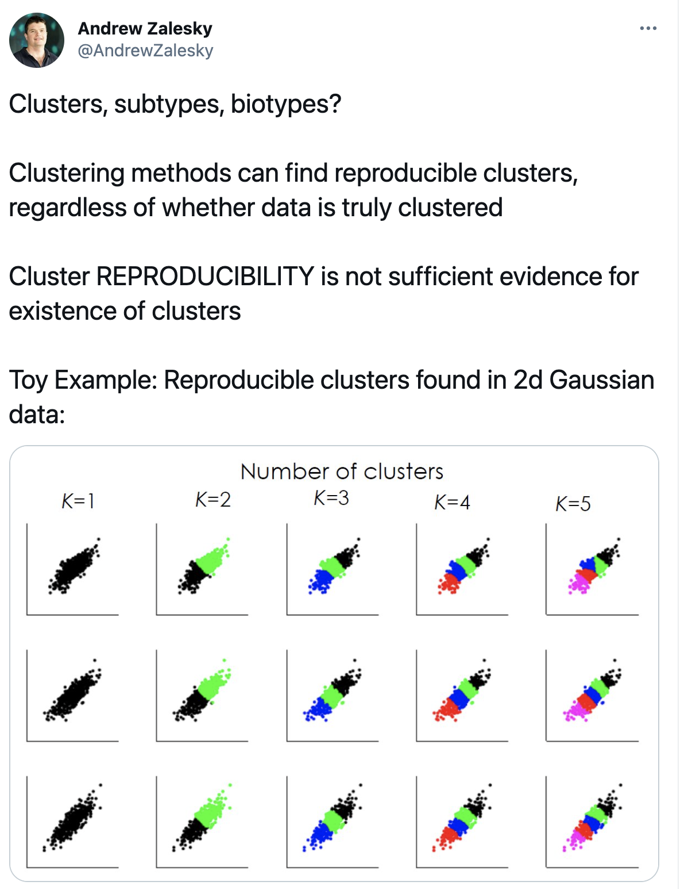
]

---

# Other considerations

Both these methods we saw right here will assign every point to one class

There are two possible kinds of problems here

- Forced to be part of a cluster
- Can only be part of one cluster
