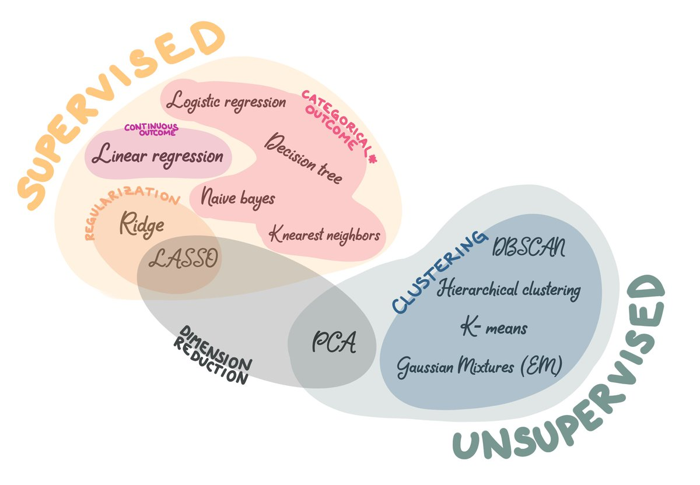

```{r, child="setup.Rmd", echo=FALSE}
```

```{r, echo=FALSE}
library(horus)
```

```{css, echo=FALSE}
.small {
  font-size: 75%;
}
```

.center[

]

.footnote[By @ChelseaParlett]

---

# Unsupervised Learning

.pull-left[
# dimensionality reduction
]

.pull-right[
# Clustering
]

---

# Dimensionality Reduction

.pull-left[

We looked at

- Principle Component Analysis
]

.pull-right[

Other methods to consider

- t-distributed Stochastic Neighbor Embedding (t-SNE)
- Autoencoder
- UMAP
- NNMF

]

---

# Dimensionality Reduction

.pull-left[

We looked at

- Principle Component Analysis
- **Lasso**
]

.pull-right[
Not just useful in linear models
]

---


# Dimensionality Reduction

.pull-left[

We looked at

- Principle Component Analysis
- Lasso
- **LDA**
]

.pull-right[
]

---

# Clustering

.pull-left[
We looked at

- K-means
- Hierarchical Clustering
]

.pull-right[
Other models

- DBSCAN
- Gaussian Mixtures
]

---

# Regularisation Methods

- Ridge
- Lasso

Serves different tasks. Can be combined in some cases

---

# Supervised Learning

.pull-left[
# Regression
]

.pull-right[
# Classification
]

---

# Supervised Learning

Many of the methods we looked at in this class can be used for both regression and classification

We mainly work with 2 types of trade-offs

- Flexibility / Interpretability
- Bias / Variance

---

# Supervised Learning

The models we saw in this class lays the foundation for most models which doesn't go under the neural network umbrella

- xgboost
- lightgbm
- catboost
- stacking

---

# Other considerations

- Implementation and run time
- What metrics are important
- Your problem statement

---

class: center

# Thank you!
