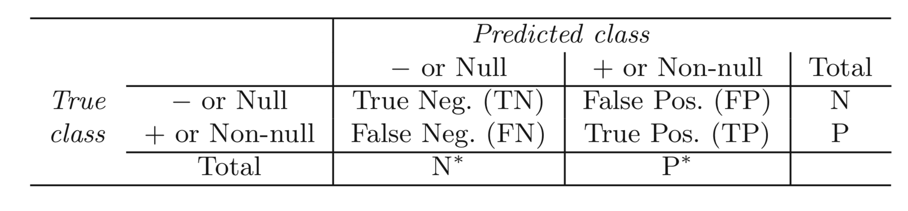

```{r, child="setup.Rmd", echo=FALSE}
```

# Classification

Last we looked at regression tasks. 
In regression the response variable $Y$ is quantitative 

In classification tasks, the response variable $Y$ is **qualitative**

This Difference will present some challenges we will cover this week

---

.center[

]

---

# Examples of classification tasks

- Should we sent an email ad to this person?
- Are these symptoms indicative of cancer?
- Given an image, which fruit is depicted?

--

Two or more classes

--

There can be uncertainty

--

Can be more than one class at the same time

---

# Classification visual

```{r, echo=FALSE}
set.seed(12345)
n <- 100
bind_rows(
  tibble(
    class = "A",
    x = rnorm(n),
    y = rnorm(n)
  ),
  tibble(
    class = "B",
    x = rnorm(n) + 5,
    y = rnorm(n) + 3
  )
) %>%
  ggplot(aes(x, y, color = class)) +
  geom_point() +
  theme_minimal() +
  guides(color = "none") +
  scale_color_manual(values = c(blue, orange))
```

---

# Classification visual - decision boundary

```{r, echo=FALSE}
set.seed(12345)
n <- 100
bind_rows(
  tibble(
    class = "A",
    x = rnorm(n),
    y = rnorm(n)
  ),
  tibble(
    class = "B",
    x = rnorm(n) + 5,
    y = rnorm(n) + 3
  )
) %>%
  ggplot(aes(x, y, color = class)) +
  geom_point() +
  theme_minimal() +
  guides(color = "none") +
  scale_color_manual(values = c(blue, orange)) +
  geom_abline(slope = -1.2, intercept = 5)
```

---

# Classification visual

```{r, echo=FALSE}
set.seed(1234)
n <- 100
bind_rows(
  tibble(
    class = "A",
    x = rnorm(n),
    y = rnorm(n)
  ),
  tibble(
    class = "B",
    x = rnorm(n) + 3,
    y = rnorm(n) + 2
  )
) %>%
  ggplot(aes(x, y, color = class)) +
  geom_point() +
  theme_minimal() +
  guides(color = "none") +
  scale_color_manual(values = c(blue, orange)) +
  geom_abline(slope = -1.2, intercept = 3)
```

---

# Classification visual - no hope

```{r, echo=FALSE}
set.seed(1234)
n <- 100
bind_rows(
  tibble(
    class = "A",
    x = rnorm(n),
    y = rnorm(n)
  ),
  tibble(
    class = "B",
    x = rnorm(n) ,
    y = rnorm(n) 
  )
) %>%
  ggplot(aes(x, y, color = class)) +
  geom_point() +
  theme_minimal() +
  guides(color = "none") +
  scale_color_manual(values = c(blue, orange))
```

---

# Nonlinear decision boundary

```{r, echo=FALSE, message=FALSE}
curve_data <- readr::read_csv("data-1.csv") 

curve_data %>%
  ggplot(aes(x, y, color = z)) +
  geom_point() +
  theme_minimal() +
  guides(color = "none") +
  scale_color_manual(values = c(blue, orange))
```

---

# Logistic regression

conceptually creates a linear line separating 2 classes

Low flexibility, explainable method

(we will talk about LDA, QLA, and K-nearest neighbors on Wednesday)

---

# Logistic regression

You might ask

--

- Why can't you use linear regression?

--

---

# Response encoding

Propose we want to classify what kind of wine to market:

- red
- white

$Y$ has to be numeric for a linear model to work.

--

We could decode $red = 0, white = 1$.

--

but what would happen if we let $\hat{Y} >1$

---

# Response encoding

What if we have more than 2 classes?

- red
- white
- .pink[rose]
- .pink[dessert]
- .pink[sparkling]

We can't do $red = 1, white = 2, rose = 3, dessert = 4, sparking = 5$ because there isn't natural ordering and nothing to indicate that dessert wine is twice of white wine

---

# Logistic regression

logistic (abstractly) models the probability that Y corresponds to a particular category

--

Now some mathematics!

---

# The Logistic Model

We want to model the relationship between $p(X) = Pr(Y = 1|X)$ and $X$.

If we use a linear formulation

$$p(X) = \beta_0 + \beta_1X$$

then we will get negative probabilities which would be no good!

---

# The Logistic Model

.pull-left[
We need to restrict the values of $p(X)$ to be between 0 and 1

We can use the .orange[logistic function]

$$f(x) = \dfrac{e^x}{1-e^x}$$

]

.pull-right[
```{r, echo=FALSE}
logisic <- function(x) {
  exp(1) ^ x / (1 + exp(1) ^ x)
}

ggplot() +
  xlim(-5, 5) +
  geom_function(fun = logisic, color = orange) +
  theme_minimal()
```
]

---

# The Logistic Model

Using the .orange[logistic function] gives us

$$p(X) = \dfrac{e^{\beta_0 + \beta_1X}}{1 + e^{\beta_0 + \beta_1X}}$$

Now no matter what the values of $X$, $\beta_0$ or $\beta_1$, $p(X)$ will always be contained between 0 and 1.

---

# The Logistic Model


If we start with 

$$p(X) = \dfrac{e^{\blue{\beta_0 + \beta_1X}}}{1 + e^{\blue{\beta_0 + \beta_1X}}}$$

and we see that .blue[this] looks familiar, it is the linear combination we saw in linear regression we saw last week

Explain what the parameter estimates mean

---

# odds

If we start with 

$$p(X) = \dfrac{e^{\beta_0 + \beta_1X}}{1 + e^{\beta_0 + \beta_1X}}$$

after rearrangement gives

$$\dfrac{p(X)}{1 + p(X)} = e^{\beta_0 + \beta_1X}$$

---

# odds

If we start with 

$$p(X) = \dfrac{e^{\beta_0 + \beta_1X}}{1 + e^{\beta_0 + \beta_1X}}$$

after rearrangement gives

$$\orange{\dfrac{p(X)}{1 + p(X)}} = e^{\beta_0 + \beta_1X}$$

.orange[This] is called the **odds** and can take any value between 0 and $\infty$.


---

# log-odds

If we start with 

$$p(X) = \dfrac{e^{\beta_0 + \beta_1X}}{1 + e^{\beta_0 + \beta_1X}}$$

after rearrangement gives

$$\dfrac{p(X)}{1 + p(X)} = e^{\beta_0 + \beta_1X}$$

taking the logarithm

$$\log\left(\dfrac{p(X)}{1 + p(X)}\right) = \beta_0 + \beta_1X$$

---

# log-odds

$$\blue{\log\left(\dfrac{p(X)}{1 + p(X)}\right)} = \beta_0 + \beta_1X$$

.blue[The left-hand side] is called the **log-odds** or **logit**.

---

# How is this a classifier?

Logistic regression is not modeling classes

Logistic regression is modeling the probabilities that Y is equal on of the classes

Logistic regression turns into a classifier by picking a cutoff (usually 50%) and classifying according to this threshold.

---

# Logistic regression decision boundary

```{r, echo=FALSE}
set.seed(1234)
n <- 100
two_class_data <- bind_rows(
  tibble(
    class = "A",
    x = rnorm(n),
    y = rnorm(n)
  ),
  tibble(
    class = "B",
    x = rnorm(n) + 3,
    y = rnorm(n) + 2
  )
) 

extract_loo_boundery <- function(x) {
estimates <- logistic_reg() %>%
  set_engine("glm") %>%
  fit(class ~ ., data = x) %>%
  tidy() %>%
  pull(estimate)


  tibble(intercept = - estimates[1] / estimates[3],
         slope = - estimates[2] / estimates[3])
}

loo_boundery <- extract_loo_boundery(mutate(two_class_data, class = factor(class)))

two_class_data %>%
  ggplot(aes(x, y, color = class)) +
  geom_point() +
  theme_minimal() +
  guides(color = "none") +
  scale_color_manual(values = c(blue, orange)) +
  geom_abline(slope = loo_boundery$slope, intercept = loo_boundery$intercept)
```

---

# Non-linear separator

```{r, echo=FALSE}
extract_loo_boundery <- function(x) {
estimates <- logistic_reg() %>%
  set_engine("glm") %>%
  fit(z ~ ., data = x) %>%
  tidy() %>%
  pull(estimate)


  tibble(intercept = - estimates[1] / estimates[3],
         slope = - estimates[2] / estimates[3])
}

loo_boundery <- extract_loo_boundery(mutate(curve_data, z = factor(z)))

curve_data %>%
  ggplot(aes(x, y, color = z)) +
  geom_point() +
  theme_minimal() +
  guides(color = "none") +
  scale_color_manual(values = c(blue, orange)) +
  geom_abline(slope = loo_boundery$slope, intercept = loo_boundery$intercept)
```

---

# Coefficients

Understanding:

> Increasing $X$ by one unit changes the log odds by a factor of $e^{\beta_1}$

> The amount of change in $p(X)$ depends on the current value of $X$

---

# Making Predictions

Fitting the model gives us $\hat{\beta_0}$ and $\hat{\beta_1}$ which we can use to construct $\hat{p}(X)$

$$\hat{p}(X) = \dfrac{e^{\hat{\beta_0} + \hat{\beta_1}X}}{1 + e^{\hat{\beta_0} + \hat{\beta_1}X}}$$

Plugging in the values of $\hat{\beta_0}$, $\hat{\beta_1}$ and $X$ gives us a prediction

---

# Example with penguins <a href='https://allisonhorst.github.io/palmerpenguins'></a>

```{r, warning=FALSE}
library(palmerpenguins)

penguins2 <- penguins %>%
  mutate(species = factor(species == "Adelie", 
                          labels = c("Adelie", "Not Adelie")))

library(parsnip)
lr_spec <- logistic_reg() %>%
  set_engine("glm") %>%
  set_mode("classification")

lr_fit <- lr_spec %>%
  fit(species ~ bill_length_mm + bill_depth_mm + body_mass_g,
      data = penguins2)
```

---

# Example with penguins <a href='https://allisonhorst.github.io/palmerpenguins'></a>

```{r, warning=FALSE}
lr_fit
```

---

# Example with penguins <a href='https://allisonhorst.github.io/palmerpenguins'></a>

```{r, warning=FALSE}
tidy(lr_fit)
```

---

# Multi class classification

We have so far only talked about what happens with 2 classes

Logistic regression isn't able to work with multiple classes since it finds 1 best line to separate 2 classes

---

# Logistic regression multiclass struggles

```{r, warning=FALSE, echo=FALSE}
penguins %>%
  ggplot(aes(bill_length_mm, flipper_length_mm, color = species)) +
  geom_point() +
  theme_minimal() +
  theme(legend.position = "top") +
  scale_color_manual(values = c(blue, orange, pink))
```

---

# Logistic regression multiclass struggles

```{r, warning=FALSE, echo=FALSE}
penguins %>%
  ggplot(aes(bill_length_mm, flipper_length_mm, color = species)) +
  geom_point() +
  theme_minimal() +
  theme(legend.position = "top") +
  scale_color_manual(values = c(blue, orange, pink)) +
  geom_abline(slope = 0.1, intercept = 200, color = pink) +
  geom_abline(slope = -5, intercept = 410, color = blue) +
  geom_abline(slope = 3.5, intercept = 35, color = orange)
```

---

# Evaluation

To evaluate a classifier we need to quantify how good and bad it is performing



Different metrics will be different algebraic combinations of the above numbers

---

# Evaluation metrics

## Accuracy 

$\dfrac{TN + TP}{TN + FN + FP + TP}$

Percentage of correct predictions

Drawback: If there are two classes A and B split 99% and 1%, you can get an accuracy of 99% by always predicting A

---

# Evaluation metrics

## Sensitivity

$\dfrac{TP}{FP + TP}$

Defined as the proportion of positive results out of the number of samples that were positive

---

# Evaluation metrics

## Specificity

$\dfrac{TP}{FP + TP}$

Measures the proportion of negatives that are correctly identified as negatives

---

# ROC curve

```{r, echo=FALSE}
roc_curve(two_class_example, truth, Class1) %>%
  ggplot(aes(x = 1 - specificity, y = sensitivity)) +
  geom_path() +
  geom_abline(lty = 3) +
  coord_equal() +
  theme_bw()
```

---

# Test-Train split

We have spent some time talking about fitting model and measuring performance

However, we need to be careful about how we go about that

performance metrics calculated on the data that was used to fit the data is likely to mislead

---

# Test-Train split

In a prediction model, we are interested in the generalized performance. e.i. how well the model can perform on data it hasn't seen

---

# Test-Train split

```{r all-split, echo = FALSE, fig.width=10}
library(forcats)
set.seed(16)
one_split <- slice(penguins, 1:30) %>% 
  initial_split() %>% 
  tidy() %>% 
  add_row(Row = 1:30, Data = "Original") %>% 
  mutate(Data = case_when(
    Data == "Analysis" ~ "Training",
    Data == "Assessment" ~ "Testing",
    TRUE ~ Data
  )) %>% 
  mutate(Data = factor(Data, levels = c("Original", "Training", "Testing")))
ggplot(one_split, aes(x = Row, y = fct_rev(Data), fill = Data)) + 
  geom_tile(color = "white",
            size = 1) + 
  #scale_fill_manual(values = splits_pal, guide = FALSE) +
  theme_minimal() +
  theme(axis.text.y = element_text(size = rel(2)),
        axis.text.x = element_blank(),
        legend.position = "top",
        panel.grid = element_blank()) +
  coord_equal(ratio = 1) +
  labs(x = NULL, y = NULL) +
  scale_fill_manual(values = c(blue, orange, pink))
```

---

# Test-Train split

We split the data into two groups (typically 75%/25%)

- training data set
- testing data set

We do the modeling on the training data set (it can be multiple models)

And then we use the testing data set **ONCE** to measure the performance

---

# Why 75%/25%?

There are no real guidelines as to how you split the data

80/20 split is also used

It Will depend on data size

---

# Why just once?

If you are working in a prediction setting, the testing data set represents fresh new data

If you modify your model you are essentially using information from the future to guide your modeling decisions

This is a kind of data-leakage and it will lead to overconfidence in the model and will come back to bite you once you start using the model

---

# How will I be able to iterate?

We will talk more about how to efficiently use data in the next two weeks

---

## How should we handle unbalanced classes?

```{r, echo=FALSE}
data("okc")

okc %>%
  select(diet) %>%
  mutate(random_split = sample(c("Training", "Testing"), n(), TRUE)) %>%
  mutate(kosher = factor(diet == "kosher", labels = c("Kosher", "Not Kosher"))) %>%
  drop_na() %>%
  ggplot(aes(kosher)) +
  geom_bar() +
  theme_minimal()
```

---

## How should we handle unbalanced classes?

```{r, echo=FALSE}
data("okc")

okc %>%
  select(diet) %>%
  mutate(random_split = sample(c("Training", "Testing"), n(), TRUE)) %>%
  mutate(kosher = factor(diet == "kosher", labels = c("Not Kosher", "Kosher"))) %>%
  drop_na() %>%
  ggplot(aes(kosher, fill = random_split)) +
  geom_bar(position = "dodge") +
  theme_minimal() +
  theme(legend.position = "top") +
  scale_fill_manual(values = c(blue, orange)) +
  labs(fill = "")
```

---

## How should we handle unbalanced classes?

```{r, echo=FALSE}

set.seed(3)

okc %>%
  select(diet) %>%
  filter(diet == "kosher") %>%
  mutate(random_split = rep(c("Training", "Testing"), c(1, 10))) %>%
  mutate(kosher = "kosher") %>%
  drop_na() %>%
  ggplot(aes(kosher, fill = random_split)) +
  geom_bar(position = "dodge") +
  theme_minimal() +
  theme(legend.position = "top") +
  scale_fill_manual(values = c(blue, orange)) +
  labs(fill = "")
```

---

# stratified sampling

This stratification also works for regression tasks. The variable can be binned and samples to ensure equal distribution between training and testing data

There is very little downside to using stratified sampling.

---

# More Data Leakage

Performing training-testing split in another place where data can leak

Any transformation done to the data should be done **AFTER** the split occurs as to not have had future information affect the modeling process 

---

# rsample <a href='https://rsample.tidymodels.org/'></a>

**sample** provides functionally to perform all different kinds of data splitting with a minimal footprint

---

# rsample example

We bring back the `penguins`

```{r}
penguins
```

---

# rsample example

Use `initial_split()` from rsample to generate a `rsplit` object

```{r}
set.seed(1234) # remember the seed!
penguins_split <- initial_split(penguins)
penguins_split
```

This object store the information of what observations belong to each data set

---

# rsample example

`training()` and `testing()` is used to extract the training data set and testing data set

```{r}
set.seed(1234) # remember the seed!
penguins_split <- initial_split(penguins)

penquins_train <- training(penguins_split)
penquins_test <- testing(penguins_split)

dim(penquins_train)
dim(penquins_test)
```
