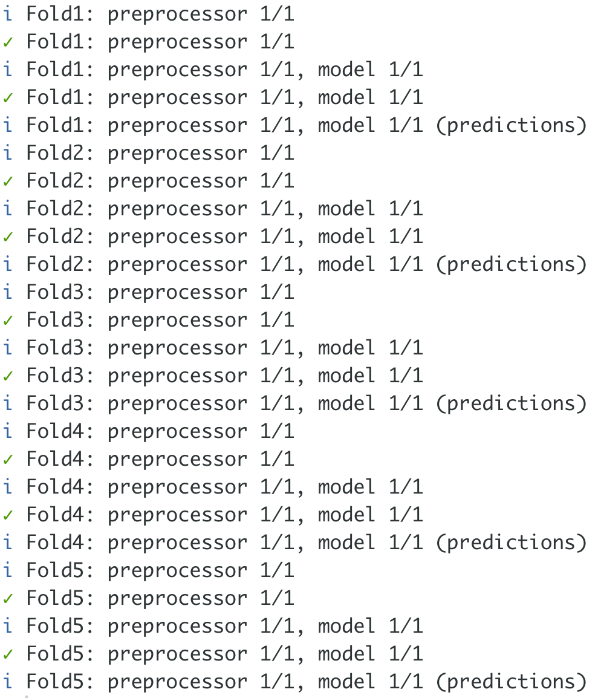

```{r, child="setup.Rmd", echo=FALSE}
```

# Motivation

We are already familiar with train-test splits

The main downside to to train-test splits so far is that we can only use them once

This means we effectively can't make any decisions about the models we are using

---

# Resampling

Resampling estimates of performance can generalize to new data


---

# Resampling Workflow

.center[

]

---

# Resampling Workflow

The resampling is only conducted on the training set

We are still keeping the test set.The test set is not involved. 

For each iteration of resampling, the data are partitioned into two subsamples:

- The model is fit with the .orange[analysis set]
- The model is evaluated with the .blue[assessment set]

---

# Resampling Workflow

We have effectively created many train-test split out of our training data set.

The .blue[challange] here now becomes how we are creating these resample sets

---

# Resampling Workflow

Suppose we generate 10 different resamples

This mean that we will be:

- Fitting 10 different models
- Perform predictions 10 times
- Prodice 10 sets of performance statistics

The final estimate of the .blue[performance] of the model will be the average of these 10 models

---

# Resampling Workflow

If the resampling is done in a appropiate way then this average has very good generalization properties

---

# Leave-One-Out Cross Validation

- 1 observation is used as the .blue[assessment set]
- The remaining observations make up the .orange[analysis set]

Notes:

We are fitting the model on $n-1$ observations and a prediction $\hat y_1$ is made on the .blue[assessment set] using the value $x_1$

---

# Leave-One-Out Cross Validation

Since $(x_1, y_1)$ is not used in the fitting process, then $MSE_1 = (y_1 - \hat y_1)^2$ provides an approximately unbiased estimate for the test error.

While this estimate is approximately unbiased, it is quite poor since it is highly variable

---

# Leave-One-Out Cross Validation

We can repeat this for 

- $MSE_2 = (y_2 - \hat y_2)^2$
- $MSE_3 = (y_3 - \hat y_3)^2$
- ...
- $MSE_n = (y_n - \hat y_n)^2$

 to get $n$ estimates of the test error
 
---

# Leave-One-Out Cross Validation

The LOOCV estimate of the test MSE is

$$CV_{(n)} = \dfrac{1}{n} \sum^n_{i=1}MSE_i$$

---

# Leave-One-Out Cross Validation

## Pros

The LOOCV estimate of the test MSE is going to have low bias

There is no randomness in the LOOCV estimate

## Cons

You need a lot of computational power even for modest data sets

(Some models don't need to be repeatedly refit)

---

# K-Fold Cross Validation

Could we think of a compromise between fitting 1 model and $n$ models?

.pink[K-Fold Cross Validation] has an answer:

Randomly divide the observations into $k$ groups (or .blue[folds]) or approximately equal size

---

# K-Fold Cross Validation

Randomly divide the observations into $k$ groups (or .blue[folds]) or approximately equal size

- 1 .blue[fold] is used as the .blue[assessment set]
- The remaining .blue[folds] make up the .orange[analysis set]

Everything else happens as before.

We now get fewer performance metrics, BUT they are each less variable

```{css, echo=FALSE}
.footnote {
    position: absolute;
    bottom: 0em;
    padding-right: 4em;
    font-size: 90%;
}
```

---
background-image: url(images/cross-validation/Slide2.png)
background-size: contain

.footnote[
Art by [Alison Hill](https://alison.rbind.io/)
]

---
background-image: url(images/cross-validation/Slide3.png)
background-size: contain

.footnote[
Art by [Alison Hill](https://alison.rbind.io/)
]

---
background-image: url(images/cross-validation/Slide4.png)
background-size: contain

.footnote[
Art by [Alison Hill](https://alison.rbind.io/)
]

---
background-image: url(images/cross-validation/Slide5.png)
background-size: contain

.footnote[
Art by [Alison Hill](https://alison.rbind.io/)
]

---
background-image: url(images/cross-validation/Slide6.png)
background-size: contain

.footnote[
Art by [Alison Hill](https://alison.rbind.io/)
]

---
background-image: url(images/cross-validation/Slide7.png)
background-size: contain

.footnote[
Art by [Alison Hill](https://alison.rbind.io/)
]

---
background-image: url(images/cross-validation/Slide8.png)
background-size: contain

.footnote[
Art by [Alison Hill](https://alison.rbind.io/)
]

---
background-image: url(images/cross-validation/Slide9.png)
background-size: contain

.footnote[
Art by [Alison Hill](https://alison.rbind.io/)
]

---
background-image: url(images/cross-validation/Slide10.png)
background-size: contain

.footnote[
Art by [Alison Hill](https://alison.rbind.io/)
]

---
background-image: url(images/cross-validation/Slide11.png)
background-size: contain

.footnote[
Art by [Alison Hill](https://alison.rbind.io/)
]

---

# Cross validation

When we perform cross-validation our goal might be to determine how well a given model is expected to perform on new data

Other times we are using cross-validation to find the best model/hyperparameters

---

# Bias-Variance radeoff of LOOCV and k-fold Cross Validation

LOOCV has a lower bias then k-fold CV

However since the mean of many highly correlated quantities has higher variance then the mean of many not correlated quantities, we have that LOOCV has a higher variance then k-fold CV

---

# Rsample

We are back with `rsample`

```{r}
library(rsample)

mtcars
```

---

# Rsample

.pull-left[
We can use the `vfold_cv()` function on a data.frame to create a `vfold_cv` object

```{r, eval=FALSE}
mtcars_folds <- vfold_cv(mtcars, v = 4)
mtcars_folds
```
]

.pull-right[
```{r, echo=FALSE}
mtcars_folds <- vfold_cv(mtcars, v = 4)
mtcars_folds
```
]


---

# Rsample

An under the hood, we have 4 analysis/assesment splits similar to `initial_split()`

.pull-left[
```{r, eval=FALSE}
mtcars_folds <- vfold_cv(mtcars, v = 4)
mtcars_folds$splits
```
]

.pull-right[
```{r, echo=FALSE}
mtcars_folds <- vfold_cv(mtcars, v = 4)
mtcars_folds$splits
```
]

---

# Using resamples in action

We start by creating a linear regression sepecification

```{r}
library(parsnip)
linear_spec <- linear_reg() %>%
  set_mode("regression") %>%
  set_engine("lm")
```

---

# Workflows

Simple package that helps us formulate more about what happens to our model.

Main functions are `workflow()`, `add_model()`, `add_formula()` or `add_variables()` (we will see `add_recipe()` later in the course)

```{r}
library(workflows)

linear_wf <- workflow() %>%
  add_model(linear_spec) %>%
  add_formula(mpg ~ disp + hp + wt)
```

---

# Workflows

This allows up to combine the model with what variables it should expect

.pull-left[
```{r, eval=FALSE}
library(workflows)

linear_wf <- workflow() %>%
  add_model(linear_spec) %>%
  add_formula(mpg ~ disp + hp + wt)
linear_wf
```
]

.pull-right[
```{r, echo=FALSE}
library(workflows)

linear_wf <- workflow() %>%
  add_model(linear_spec) %>%
  add_formula(mpg ~ disp + hp + wt)
linear_wf
```
]

---

`add_variables()` allows for a different way of specifying the the response and predictors in our model

# Workflows

.pull-left[
```{r, eval=FALSE}
library(workflows)

linear_wf <- workflow() %>%
  add_model(linear_spec) %>%
  add_variables(outcomes = mpg,
                predictors = c(disp, hp, wt))
linear_wf
```
]

.pull-right[
```{r, echo=FALSE}
library(workflows)

linear_wf <- workflow() %>%
  add_model(linear_spec) %>%
  add_variables(outcomes = mpg,
                predictors = c(disp, hp, wt))
linear_wf
```
]

---

# Workflows

You can use a `workflow` just like a parsnip object and fit it directly

```{r}
fit(linear_wf, data = mtcars)
```

---

# Tune

We introduce the **tune** package. This package helps us fit many models in a controlled manner in the tidymodels framework. It relies heavily on parsnip and rsample

---

# Tune

We can use `fit_resamples()` to fit the workflow we created within each resample

```{r}
library(tune)

linear_fold_fits <- fit_resamples(
    linear_wf,
    resamples = mtcars_folds
)
```

---

# Tune

The results of this resampling comes as a data.frame

```{r}
linear_fold_fits
```

---

# Tune

`collect_metrics()` can be used to extract the CV estimate

```{r}
library(tune)

linear_fold_fits <- fit_resamples(
    linear_wf,
    resamples = mtcars_folds
)

collect_metrics(linear_fold_fits)
```

---

# Tune

Setting `summarize = FALSE` in `collect_metrics()` Allows us the see the individual performance metrics for each fold

```{r}
collect_metrics(linear_fold_fits, summarize = FALSE)
```

---


.pull-left[
# Tune

There are some settings we can set with `control_resamples()`.

One of the most handy ones (IMO) is `verbose = TRUE`

```{r, eval=FALSE}
library(tune)

linear_fold_fits <- fit_resamples(
  linear_wf,
  resamples = mtcars_folds,
  control = control_resamples(verbose = TRUE)
)
```
]

.pull-right[
.center[

]
]

---

# Tune

We can also directly specify the metrics that are calculated within each resample

```{r}
library(tune)

linear_fold_fits <- fit_resamples(
    linear_wf,
    resamples = mtcars_folds, 
    metrics = metric_set(rmse, rsq, mase)
)

collect_metrics(linear_fold_fits)
```

---

# Bootstrapping

Last week we looked at a couple of different Cross-Validation methods

- Leave-One-Out Cross-Validation (LOOCV)
- K-fold Cross-Validation

---

# Bootstrapping

This week we will look at .orange[Bootstrapping]

This is a technique that uses resampling with replacement to estimate the uncertainty with a given estimator or statistical learning method

It is a powerful and general statistical tool, and can be used with most estimators/methods

---

# Bootstrapping VS Cross-Validation

- .blue[Cross-Validation]: provide estimates of the test error.
- .orange[Bootstrap]: provides the standard error of the estimates.

---

# Motivation

.pull-left[
Suppose We have an estimate we want to find out how variable it is.

We could collect data $n$ times and calculate the estimates.

We then have a distribution of and can see the how well it is doing
]

.pull-right[
1000 realizations  
.pink[pink] line is the mean  
.orange[orange] lines 95% percent quantiles

```{r, echo=FALSE}
tibble(estimate = rnorm(1000, 15, 2.5)) %>%
  ggplot(aes(estimate)) +
  geom_histogram(bins = 100) +
  theme_minimal() +
  geom_vline(aes(xintercept = mean(estimate)),
             color = pink) +
  geom_vline(aes(xintercept = quantile(estimate, 0.025)),
             color = orange) +
  geom_vline(aes(xintercept = quantile(estimate, 0.975)),
             color = orange)
```
]

---

# Motivation

## The Problem

We are not always able to conduct multiple data collections at will

Sometimes for resource issues or time-sensitive data

We need the different samples to come from the same underlying distribution

---

# Motivation

## The Solution

We take our one data set and resample the rows with replacement. This allows us to get new data sets that approximate the original data set

If the original data set is close to the underlying true distribution then the resampled data sets are also approximations of the true underlying distribution

---

# Example

From "An Introduction to Statistical Learning"

```{r, echo=FALSE}
set.seed(1234)
Sigma <- matrix(c(1,0.5,0.5,1.25), nrow = 2)
data <- MASS::mvrnorm(n = 100, rep(0, 2), Sigma)
```

```{r, echo=FALSE}
as_tibble(data) %>%
  set_names(c("X", "Y")) %>%
  ggplot(aes(X, Y)) +
  geom_point() +
  theme_minimal() +
  labs(title = "Original Data")
```

---

# Example

Visualizing multiple bootstrappings

```{r, echo=FALSE}
as_tibble(data) %>%
  set_names(c("X", "Y")) %>%
  bootstraps(times = 9) %>%
  mutate(splits = map(splits, analysis)) %>%
  unnest(cols = c(splits)) %>%
  count(X, Y, id) %>%
  ggplot(aes(X, Y, color = n)) +
  geom_point() +
  theme_minimal() +
  facet_wrap(~id) +
  scale_color_viridis_c() +
  labs(title = "9 reaelizations of Bootstrapping",
       subtitle = "Color indicates the number of times the observation is sampled")
```

---

# Example

We want to minimize

$$\alpha = \dfrac{\sigma^2_Y - \sigma_{XY}}{\sigma^2_X + \sigma^2_Y - 2\sigma_{XY}}$$


Where $\sigma^2_X = \text{Var}(X)$, $\sigma^2_Y = \text{Var}(Y)$, and $\sigma_{XY} = \text{Cov}(X, Y)$

---

# Bootstrapping results

```{r, echo=FALSE}
set.seed(1234)
all_boots <- as_tibble(data) %>%
  set_names(c("X", "Y")) %>%
  bootstraps(times = 1000) %>%
  mutate(splits = map(splits, analysis)) %>%
  unnest(col = c("splits")) %>%
  group_by(id) %>%
  summarise(var_x = var(X), var_y = var(Y), cov_xy = cov(X, Y)) %>%
  mutate(estimate = (var_y - cov_xy) / (var_x + var_y - 2 * cov_xy))

all_boots
```

---

# Bootstrapping results

With $n = 100$ in original data set

```{r, echo=FALSE}
quantiles <- all_boots %>%
  pivot_longer(-id) %>%
  group_by(name) %>%
  summarise(mean = mean(value),
            lower = quantile(value, 0.025),
            higher = quantile(value, 0.975))

all_boots %>%
  pivot_longer(-id) %>%
  ggplot(aes(value)) +
  geom_histogram(bins = 100) +
  facet_wrap(~name) +
  geom_vline(aes(xintercept = mean), data = quantiles, 
             color = pink) +
  geom_vline(aes(xintercept = lower), data = quantiles, 
             color = orange) +
  geom_vline(aes(xintercept = higher), data = quantiles, 
             color = orange) +
  theme_minimal()
```

---

# Bootstrapping results

With $n = 1000$ in original data set

```{r, echo=FALSE}
set.seed(1234)
Sigma <- matrix(c(1,0.5,0.5,1.25), nrow = 2)
data <- MASS::mvrnorm(n = 1000, rep(0, 2), Sigma)

all_boots <- as_tibble(data) %>%
  set_names(c("X", "Y")) %>%
  bootstraps(times = 1000) %>%
  mutate(splits = map(splits, analysis)) %>%
  unnest(col = c("splits")) %>%
  group_by(id) %>%
  summarise(var_x = var(X), var_y = var(Y), cov_xy = cov(X, Y)) %>%
  mutate(estimate = (var_y - cov_xy) / (var_x + var_y - 2 * cov_xy))

quantiles <- all_boots %>%
  pivot_longer(-id) %>%
  group_by(name) %>%
  summarise(mean = mean(value),
            lower = quantile(value, 0.025),
            higher = quantile(value, 0.975))

all_boots %>%
  pivot_longer(-id) %>%
  ggplot(aes(value)) +
  geom_histogram(bins = 100) +
  facet_wrap(~name) +
  geom_vline(aes(xintercept = mean), data = quantiles, 
             color = pink) +
  geom_vline(aes(xintercept = lower), data = quantiles, 
             color = orange) +
  geom_vline(aes(xintercept = higher), data = quantiles, 
             color = orange) +
  theme_minimal()
```

---

# Bootstrapping results

With $n = 10000$ in original data set

```{r, echo=FALSE}
set.seed(1234)
Sigma <- matrix(c(1,0.5,0.5,1.25), nrow = 2)
data <- MASS::mvrnorm(n = 10000, rep(0, 2), Sigma)

all_boots <- as_tibble(data) %>%
  set_names(c("X", "Y")) %>%
  bootstraps(times = 1000) %>%
  mutate(splits = map(splits, analysis)) %>%
  unnest(col = c("splits")) %>%
  group_by(id) %>%
  summarise(var_x = var(X), var_y = var(Y), cov_xy = cov(X, Y)) %>%
  mutate(estimate = (var_y - cov_xy) / (var_x + var_y - 2 * cov_xy))

quantiles <- all_boots %>%
  pivot_longer(-id) %>%
  group_by(name) %>%
  summarise(mean = mean(value),
            lower = quantile(value, 0.025),
            higher = quantile(value, 0.975))

all_boots %>%
  pivot_longer(-id) %>%
  ggplot(aes(value)) +
  geom_histogram(bins = 100) +
  facet_wrap(~name) +
  geom_vline(aes(xintercept = mean), data = quantiles, 
             color = pink) +
  geom_vline(aes(xintercept = lower), data = quantiles, 
             color = orange) +
  geom_vline(aes(xintercept = higher), data = quantiles, 
             color = orange) +
  theme_minimal()
```

---

# What size of bootstrappings are we looking for?

We are using bootstrapping sizes to be the same size of to get a comparatively estimate of the variation

---


# Rsample

We are back with `rsample` and the `mtcars` data set

```{r}
library(rsample)

mtcars
```

---

# Rsample

.pull-left[
We can use the `bootstraps()` function on a data.frame to create a `bootstraps` object

```{r, eval=FALSE}
mtcars_boots <- bootstraps(mtcars, times = 100)
mtcars_boots
```
]

.pull-right[
```{r, echo=FALSE}
mtcars_boots <- bootstraps(mtcars, times = 100)
mtcars_boots
```
]

---

# Rsample

An under the hood, we have 100 analysis/assesment splits similar to `initial_split()` and `vfold_cv()`

.pull-left[
```{r, eval=FALSE}
mtcars_boots <- bootstraps(mtcars, times = 100)
mtcars_boots$splits
```
]

.pull-right[
```{r, echo=FALSE}
mtcars_boots <- bootstraps(mtcars, times = 100)
mtcars_boots$splits
```
]

---

# Using resamples in action

We start by creating a linear regression specification and create a `workflow` object with `workflows()`

```{r}
library(parsnip)
linear_spec <- linear_reg() %>%
  set_mode("regression") %>%
  set_engine("lm")

library(workflows)

linear_wf <- workflow() %>%
  add_model(linear_spec) %>%
  add_formula(mpg ~ disp + hp + wt)
```

---

# Tune

We can use `fit_resamples()` to fit the workflow we created within each bootstrap

```{r}
library(tune)

linear_fold_fits <- fit_resamples(
    linear_wf,
    resamples = mtcars_boots
)
```

---

# Tune

The results of this resampling comes as a data.frame

```{r}
linear_fold_fits
```

---

# Tune

`collect_metrics()` can be used to extract the CV estimate

```{r}
library(tune)

collect_metrics(linear_fold_fits)
```

---

# Tune

Setting `summarize = FALSE` in `collect_metrics()` Allows us the see the individual performance metrics for each fold

```{r}
collect_metrics(linear_fold_fits, summarize = FALSE)
```
