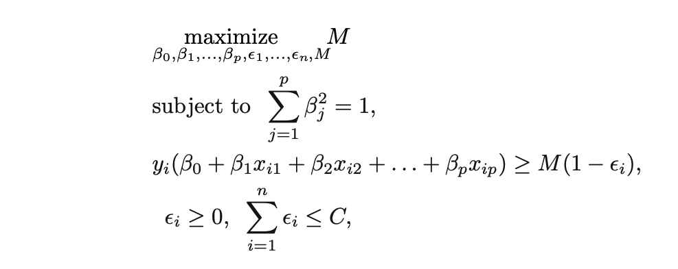

```{r, child="setup.Rmd", echo=FALSE}
```

```{r, echo=FALSE}
library(horus)
```

```{css, echo=FALSE}
.small {
  font-size: 75%;
}
```


# Boston Data Set

.small[
.pull-left[
- **crim** per capita crime rate by town.
- **zn** proportion of residential land zoned for lots over 25,000 sq.ft.
- **indus** proportion of non-retail business acres per town.
- **chas** Charles River dummy variable (= 1 if tract bounds river; 0 otherwise).
- **nox** nitrogen oxides concentration (parts per 10 million).
- **rm** average number of rooms per dwelling.
- **age** proportion of owner-occupied units built prior to 1940
]

.pull-right[
- **dis** weighted mean of distances to five Boston employment centres.
- **rad** index of accessibility to radial highways.
- **tax** full-value property-tax rate per $10,000.
- **ptratio** pupil-teacher ratio by town.
- **black** 1000(Bk - 0.63)^2 where Bk is the proportion of blacks by town.
- **lstat** lower status of the population (percent).
- **medv** median value of owner-occupied homes in $1000s.
]
]

---

# Boston Data Set

**black** 1000(Bk - 0.63)^2 where Bk is the proportion of blacks by town.

---

# Support Vector Machines

A fairly new contender in the machine learning space

A generalization of the **maximal margin classifier**

We will talk about 

- the maximal margin classifier
- How it can be extended to the support vector classifier (SVM)
- How the SVM can be extended using non-linear separators

---

# What is a hyperplane?

We know that a line can separate a 2-dimensional space, and the plane can separate a 3-dimensional space

A **hyperplane** in $p$ dimensions is a flat subspace of dimension $p-1$

This will generalize to any number of dimensions but can be hard to visualize for $p>3$

---

# What is a hyperplane?

A hyperplane will separate a space into regions, one for each side (technically 3 since a point can be directly on the hyperplane)

In two dimensions a hyperplane is defined by the equation

$$\beta_0 + \beta_1 X_1 + \beta_2 X_2 = 0$$

And this is the hyperplane where any pair of $X = (X_1, X_2)^T$ that satisfy this equation is on the hyperplane

---

# What is a hyperplane?

The two regions formed by this hyperplane are the points that satisfy

$$\beta_0 + \beta_1 X_1 + \beta_2 X_2 > 0$$

and 

$$\beta_0 + \beta_1 X_1 + \beta_2 X_2 < 0$$

---

# $0.2 + 0.2 X - 0.8 Y = 0$

```{r, echo=FALSE}
set.seed(1)
tibble(
  x = runif(150),
  y = runif(150)
) %>%
  mutate(class = 0.2 + 0.2 * x - 0.8 * y < 0) %>%
  ggplot(aes(x, y, color = class)) +
  geom_point() +
  guides(color = "none") +
  scale_color_manual(values = c(blue, orange)) +
  geom_function(fun = ~ 0.25 * .x + 0.25, color = "black")
```

---

# Creating a classifier

Idea:

Given some data, we can find a hyperplane that separates the data

such that we can use the hyperplane defined to classify new observations

---

# The Maximal Margin Classifier

There might be many different hyperplanes that separate

that can separate two different regions but we would ideally want to have only one

The **Maximal Margin Classifier** aims the find the hyperplane that separates the perpendicular distance to the 

---

### Hyperplane only depends on closest points

```{r, echo=FALSE}
set.seed(2)
mmc_data <- tibble(
  x = runif(10),
  y = runif(10)
) %>%
  mutate(class = factor(0.2 + 0.2 * x - 0.8 * y < 0),
         nrow = factor(row_number()))

mmc_data %>%
  ggplot(aes(x, y, color = class)) +
  geom_point() +
  guides(color = "none") +
  scale_color_manual(values = c(blue, orange)) +
  geom_function(fun = ~ 0.25 * .x + 0.25, color = "black")
```

---

### Hyperplane only depends on closest points

```{r, echo=FALSE}
set.seed(2)
mmc_data <- tibble(
  x = runif(10),
  y = runif(10)
) %>%
  mutate(class = factor(0.2 + 0.2 * x - 0.8 * y < 0),
         nrow = row_number())
  
mmc_data$x[mmc_data$nrow %in% c(1, 3, 6, 7)] <- runif(4, 0, 0.05)
mmc_data$y[mmc_data$nrow %in% c(1, 3, 6, 7)] <- runif(4, 0.9, 1)

mmc_data$x[mmc_data$nrow %in% c(2, 8, 10)] <- runif(3, 0.5, 0.55)
mmc_data$y[mmc_data$nrow %in% c(2, 8, 10)] <- runif(3, 0, 0.05)

mmc_data %>%
  ggplot(aes(x, y, color = class)) +
  geom_point() +
  guides(color = "none") +
  scale_color_manual(values = c(blue, orange)) +
  geom_function(fun = ~ 0.25 * .x + 0.25, color = "black")
```

---

# Support vectors

The vectors from the border points to the hyperplane are the support vectors

These are the only points that directly have any influence on the model

---

# What happens when we can't separate the regions?

The idea of a Maximal Margin Classifier is great but it will rarely work in practice since it only works for regions that are separately

Create an extension that allows for hyperplanes that "almost" separate the regions

This hyperplane would be called a *soft margin*

---

# Support Vector Classifiers

- Greater robustness to individual observations, and
- Better classification of most of the training observations.

This is once again a trade-off

---

# Support Vector Classifiers

How do we create hyperplanes that "almost" separate our two classes of observations

.center[

]

where C is a non-negative tuning parameter. and M is the width of the margin

---

# Support Vector Classifiers

$\epsilon_1, ..., \epsilon_n$ are *slack variables*

and they allow individual observations to be on the wrong side of the margin or the hyperplane

if

- $\epsilon_i = 0$ then the $i$th observation is on the right side of the hyperplane
- $\epsilon_i > 0$ then the $i$th observation is on the wrong side of the margin
- $\epsilon_i > 1$ then the $i$th observation is on the wrong side of the hyperplane

---

# Support Vector Classifiers

We can think of $C$ as a budget of violations

- if $C=0$ then we have a maximal margin classifier
- if $C>0$ no more than $C$ observations can be on the wrong side of the hyperplane

When $C$ increase we become more tolerant of violations and the margin widens

When $C$ decreases we become less tolerant of violations and the margin widens

---

# Support Vector Classifiers

Note:

SVM are typically fitted iteratively, if $C$ is chosen too low then there are no correct solutions

---

# Support Vector Classifiers

$C$ is essentially a tuning parameter that controls the bias-variance trade-off

- Small $C$ gives narrow margins that are rarely violated, highly fit to the data, low bias, high variance
- Large $C$ gives wide margins that are more often violated, loosely fit to data, high bias, low variance

---

# Support Vector Classifiers

Only wrongly predicted points affect the hyperplane

Support Vector Classifier are very robust to outliers as they have no effect

---

# Support Vector Machine

Support vector classifiers work well when the classes are linearly separable

We saw in earlier chapters how we handle non-linear transformations by enlargening the feature-space

We can do this in (at least) two ways, using .blue[polynomials] and .orange[kernels]

---

# Support Vector Machine

Without going into too many details, the main the algorithm at works ends up calculation similarities between two observations

$K(x_i, x_{i'})$

Which is some function called a *kernel*.

Depending on what $K$ is we get different results.

---

# Support Vector Machine

$$K(x_i, x_{i'}) = \sum_{j=1}^p x_{ij}x_{i'j}$$

is known as a linear kernel

---

```{r, echo=FALSE}
data1 <- readr::read_csv("data.csv", col_types = "ddf")
```

---

# Linear kernel

```{r, echo=FALSE}
svm_spec <- svm_poly(degree = 1) %>%
  set_mode("classification") %>%
  set_engine("kernlab")

svm_fit <- workflow() %>%
  add_formula(z ~ x + y) %>%
  add_model(svm_spec) %>%
  fit(data1)

viz_decision_boundary(svm_fit, data1) +
  scale_fill_manual(values = c(pink, blue)) +
  guides(fill = "none") +
  theme_void()
```

---

# Support Vector Machine

$$K(x_i, x_{i'}) = \left(1 + \sum_{j=1}^p x_{ij}x_{i'j}\right)^d$$

is known as a polynomial kernel of degree $d$

---

# Polynomial kernel of degree 2

```{r, echo=FALSE}
svm_spec <- svm_poly(degree = 2) %>%
  set_mode("classification") %>%
  set_engine("kernlab")

svm_fit <- workflow() %>%
  add_formula(z ~ x + y) %>%
  add_model(svm_spec) %>%
  fit(data1)

viz_decision_boundary(svm_fit, data1) +
  scale_fill_manual(values = c(pink, blue)) +
  guides(fill = "none") +
  theme_void()
```

---

# Polynomial kernel of degree 3

```{r, echo=FALSE}
svm_spec <- svm_poly(degree = 3) %>%
  set_mode("classification") %>%
  set_engine("kernlab")

svm_fit <- workflow() %>%
  add_formula(z ~ x + y) %>%
  add_model(svm_spec) %>%
  fit(data1)

viz_decision_boundary(svm_fit, data1) +
  scale_fill_manual(values = c(pink, blue)) +
  guides(fill = "none") +
  theme_void()
```

---

# Polynomial kernel of degree 15

```{r, echo=FALSE, message=FALSE, warning=FALSE}
svm_spec <- svm_poly(degree = 15) %>%
  set_mode("classification") %>%
  set_engine("kernlab")

svm_fit <- workflow() %>%
  add_formula(z ~ x + y) %>%
  add_model(svm_spec) %>%
  fit(data1)

viz_decision_boundary(svm_fit, data1) +
  scale_fill_manual(values = c(pink, blue)) +
  guides(fill = "none") +
  theme_void()
```

---

# Support Vector Machine

$$K(x_i, x_{i'}) = \exp\left(-\gamma\sum_{j=1}^p (x_{ij}x_{i'j})^2\right)$$

is known as a radial kernel

Where $\gamma$ is a positive constant

This means that the radial kernel has very *local* behavior

---

# radial kernel $\gamma = 1$

```{r, echo=FALSE}
svm_spec <- svm_rbf(rbf_sigma = 1) %>%
  set_mode("classification") %>%
  set_engine("kernlab")

svm_fit <- workflow() %>%
  add_formula(z ~ x + y) %>%
  add_model(svm_spec) %>%
  fit(data1)

viz_decision_boundary(svm_fit, data1) +
  scale_fill_manual(values = c(pink, blue)) +
  guides(fill = "none") +
  theme_void()
```

---

# radial kernel $\gamma = 10$

```{r, echo=FALSE}
svm_spec <- svm_rbf(rbf_sigma = 10) %>%
  set_mode("classification") %>%
  set_engine("kernlab")

svm_fit <- workflow() %>%
  add_formula(z ~ x + y) %>%
  add_model(svm_spec) %>%
  fit(data1)

viz_decision_boundary(svm_fit, data1) +
  scale_fill_manual(values = c(pink, blue)) +
  guides(fill = "none") +
  theme_void()
```

---

# radial kernel $\gamma = 100$

```{r, echo=FALSE}
svm_spec <- svm_rbf(rbf_sigma = 100) %>%
  set_mode("classification") %>%
  set_engine("kernlab")

svm_fit <- workflow() %>%
  add_formula(z ~ x + y) %>%
  add_model(svm_spec) %>%
  fit(data1)

viz_decision_boundary(svm_fit, data1) +
  scale_fill_manual(values = c(pink, blue)) +
  guides(fill = "none") +
  theme_void()
```

---

# SVMs for more than 2 classes

This is actually a more general question

How do we extend a binary classifier to multi-classification

- one-versus-one
- one-versus-all

---

# One-Versus-One Classification

If we have $K>2$ classes

We construct ${K}\choose{2}$ binary classification models, each comparing 2 classes

An observation is classified by running each of the ${K}\choose{2}$ and tallying up the results

The observation is assigned the class that was predicted most often in the ${K}\choose{2}$ models

---

# One-Versus-All Classification

If we have $K>2$ classes

We fit $K$ models, each comparing 1 class against the $K-1$ remaining classes

Whichever model performs best wins the observation

